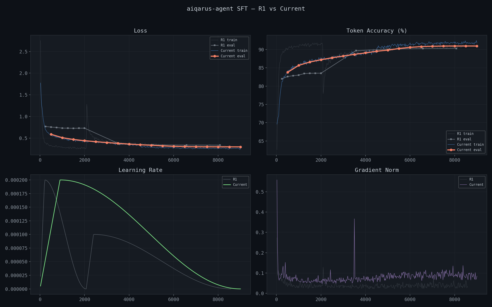

# aiqarus-agent-4b

Fine-tuned [Qwen3-4B-Instruct](https://huggingface.co/Qwen/Qwen3-4B-Instruct-2507) for enterprise AI agent tasks — tool-calling, multi-step planning, risk escalation, confidence calibration, and multi-agent handoff.

Iteratively improved across two training rounds, with LLM-as-judge evaluation driving data and methodology changes between rounds.

**Model:** [huggingface.co/zeon01/aiqarus-agent-4b](https://huggingface.co/zeon01/aiqarus-agent-4b)

## What's Here

| Script | Purpose |
|---|---|
| `prepare_dataset.py` | Round 1: filter, merge, and format 51K training samples |
| `prepare_dataset_v2.py` | Round 2: rebuilt dataset pipeline (77K samples, balanced actions) |
| `training/train.py` | Round 1: QLoRA fine-tuning on Modal (2-stage curriculum, A10G) |
| `training/train_v2.py` | Round 2: QLoRA fine-tuning on Modal (flattened curriculum, B200) |
| `training/test_harness.py` | Single-turn eval — 230 test cases |
| `training/eval_comparative.py` | Multi-turn eval — 110 conversation-flow cases |
| `training/eval_bfcl.py` | BFCL v4 benchmark runner (Modal + vLLM) |
| `training/eval_when2call.py` | When2Call benchmark runner (Modal) |
| `training/llm_judge.py` | LLM-as-judge scoring pipeline |
| `training/push_to_hf.py` | Merge LoRA + push to HuggingFace from Modal |

## Current: Round 2 (V2)

- **Base model:** Qwen/Qwen3-4B-Instruct-2507
- **Method:** QLoRA (4-bit NF4, rank=32, alpha=64)
- **Dataset:** 77K samples (public datasets + custom enterprise data, balanced action types)
- **Curriculum:** Flattened (all data mixed from epoch 1)
- **Hardware:** NVIDIA B200 on Modal.com (~11 hours)
- **Final loss:** 0.288 | **Token accuracy:** ~91.2%

### Training Curves (R1 vs R2)



R1 (grey): visible loss spike at step ~2,076 where Stage 2 data introduced a distribution shift. R2 (blue/green): smooth throughout — flattened curriculum eliminates the shock.

### Results

**Custom eval (230 enterprise cases, dual LLM judges):**

| Metric | R1 | R2 (Codex / Gemini) |
|---|---|---|
| Action accuracy | 38.7% | **44.3% / 59.1%** |
| Reasoning quality | 2.1/5 | **3.1 / 3.2** |
| Response quality | 1.9/5 | **2.8 / 2.9** |
| Risk escalation | 4% | **40% / 60%** |

**Multi-turn eval (110 cases):** Composite **4.10/5** — multi-step chaining, error recovery, scope creep detection, injection defense.

**External benchmarks:**

| Benchmark | Finetuned | Base | Delta | Notes |
|---|---|---|---|---|
| When2Call accuracy | 47.7% | 41.1% | +6.6% | MCQ format, directional |
| BFCL v4 overall | 21.32% | 35.68% | -14.36% | Format mismatch (FC vs `<tool_call>`) |

## Round 1 (V1)

- **Dataset:** 51K samples, 2-stage curriculum, A10G, ~17 hours
- **Result:** 38.7% true accuracy (LLM judge). Heuristic reported 53% — misleading.
- **Root cause:** 80% tool-calling bias, zero negative examples, no adversarial data.
- See [Round 1 details on HuggingFace](https://huggingface.co/zeon01/aiqarus-agent-4b).

## Try It

```python
from transformers import AutoModelForCausalLM, AutoTokenizer
import torch

model = AutoModelForCausalLM.from_pretrained(
    "zeon01/aiqarus-agent-4b",
    torch_dtype=torch.bfloat16,
    device_map="auto",
    trust_remote_code=True,
)
tokenizer = AutoTokenizer.from_pretrained("zeon01/aiqarus-agent-4b", trust_remote_code=True)

messages = [
    {"role": "system", "content": "You are an enterprise AI agent with access to tools."},
    {"role": "user", "content": "Find all customers with contracts expiring this quarter."}
]

text = tokenizer.apply_chat_template(messages, tokenize=False, add_generation_prompt=True)
inputs = tokenizer(text, return_tensors="pt").to(model.device)
outputs = model.generate(**inputs, max_new_tokens=512, temperature=0.6, do_sample=True)
print(tokenizer.decode(outputs[0][inputs.input_ids.shape[-1]:], skip_special_tokens=True))
```

## License

Apache 2.0
